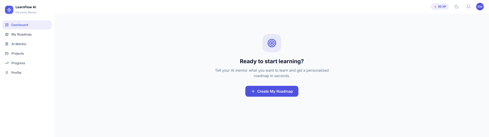
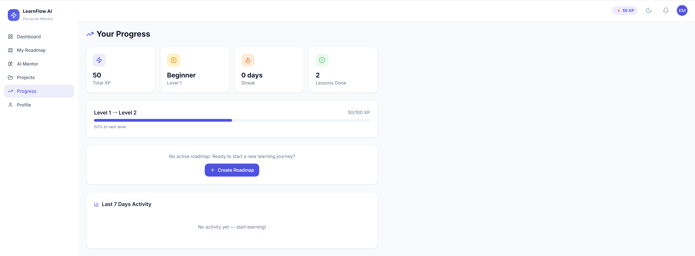

# LearnFlow AI

An AI-powered learning platform that generates personalized, resource-based roadmaps. Tell it what you want to learn — it builds a step-by-step curriculum with curated YouTube videos, articles, and official documentation for each lesson.



---

## Features

- **AI Roadmap Generation** — Describe your learning goal and experience level; GPT-4o generates a structured roadmap tailored to you
- **Curated Resource Links** — Every lesson comes with real YouTube tutorials, official docs, and free articles — no AI-written content, just the best links
- **Sequential Lesson Unlocking** — Complete a lesson to unlock the next one, keeping you on track
- **XP & Level System** — Earn XP for every completed lesson; level up as you progress
- **Daily Streak Tracking** — Stay motivated with streak counters and weekly activity charts
- **Real-time Notifications** — Get notified when the next lesson unlocks or you level up
- **Progress Dashboard** — Visual progress bar, today's tasks, and current roadmap overview
- **Delete Roadmap / Account** — Full data control with confirmation prompts and disclaimers
- **Dark Mode** — Full light/dark theme support

---

## Tech Stack

| Layer | Technology |
|---|---|
| Frontend | React 19, TypeScript, Vite, Tailwind CSS v3 |
| State / Data | TanStack Query (React Query), React Router v6 |
| Animations | Framer Motion |
| Backend | Laravel 12, PHP 8.2+ |
| Auth | Laravel Sanctum (token-based) |
| Database | MySQL 8+ |
| AI | OpenAI GPT-4o via REST API |

---

## Screenshots

| Dashboard | My Roadmap | Lesson View |
|---|---|---|
|  |  |  |

| Progress | Onboarding | Profile |
|---|---|---|
|  |  |  |

---

## Prerequisites

Make sure you have the following installed before you begin:

- **PHP** 8.2 or higher — [php.net/downloads](https://www.php.net/downloads)
- **Composer** 2.x — [getcomposer.org](https://getcomposer.org)
- **Node.js** 20+ and **npm** — [nodejs.org](https://nodejs.org)
- **MySQL** 8.0+ — [mysql.com](https://dev.mysql.com/downloads/)
- **Git** — [git-scm.com](https://git-scm.com)
- An **OpenAI API key** — [platform.openai.com/api-keys](https://platform.openai.com/api-keys)

---

## Local Installation

### 1. Clone the repository

```bash
git clone https://github.com/mohakamran/LearnFlow.git
cd LearnFlow
```

### 2. Backend setup

```bash
cd backend

# Install PHP dependencies
composer install

# Copy the environment file
cp .env.example .env

# Generate the application key
php artisan key:generate
```

### 3. Configure your environment (see Security section below)

Open `backend/.env` and fill in:

```env
# Database
DB_DATABASE=learnflow_ai
DB_USERNAME=root
DB_PASSWORD=your_mysql_password

# Your OpenAI API key (keep this secret — never commit it)
OPENAI_API_KEY=sk-...

# Frontend URL (for CORS)
FRONTEND_URL=http://localhost:5173
```

### 4. Set up the database

Create the MySQL database first:

```sql
CREATE DATABASE learnflow_ai CHARACTER SET utf8mb4 COLLATE utf8mb4_unicode_ci;
```

Then run migrations:

```bash
php artisan migrate
```

### 5. Start the backend server

```bash
php artisan serve
# Runs at http://localhost:8000
```

### 6. Frontend setup

Open a new terminal:

```bash
cd frontend

# Install Node dependencies
npm install

# Start the dev server
npm run dev
# Runs at http://localhost:5173
```

### 7. Open the app

Navigate to **http://localhost:5173** in your browser. Register an account and add your OpenAI API key from the Settings page (gear icon) to start generating roadmaps.

---

## Keeping Your API Key Secure

Your OpenAI API key is sensitive — treat it like a password. Follow these rules:

### Never commit your `.env` file

The `.gitignore` already excludes `.env`, but double-check before every push:

```bash
git status           # should NOT show backend/.env
cat backend/.gitignore | grep .env   # should show .env
```

### Store secrets only in `.env` — never in source code

**Wrong:**
```php
// DO NOT DO THIS
$apiKey = 'sk-abc123...';
```

**Right:**
```php
// Always read from environment
$apiKey = config('ai.providers.openai.api_key');  // reads from .env via config/ai.php
```

### Use `.env.example` as a template (already done in this project)

The repository includes `.env.example` with all keys listed but with **empty values**. This is safe to commit — it documents what's needed without exposing real secrets:

```env
OPENAI_API_KEY=        # ← empty, just a placeholder
```

When you clone the project, copy `.env.example` → `.env` and fill in your real values locally.

### On production / deployment

- Set environment variables directly in your hosting dashboard (Forge, Railway, Heroku, etc.)
- Never upload `.env` to the server via FTP or Git
- Rotate your API key immediately if you ever suspect it was exposed

### Validate the key before saving

The app validates your OpenAI key against the API before storing it — invalid keys are rejected. You can add your key from **Settings → AI Configuration** inside the app.

---

## Project Structure

```
LearnFlow/
├── backend/                  # Laravel 12 API
│   ├── app/
│   │   ├── Http/
│   │   │   ├── Controllers/API/V1/   # Route controllers
│   │   │   └── Resources/            # JSON serializers
│   │   ├── Models/                   # Eloquent models
│   │   └── Services/
│   │       ├── AI/                   # OpenAI integration
│   │       │   └── Providers/
│   │       │       └── OpenAIProvider.php  # Roadmap prompt & generation
│   │       └── RoadmapService.php    # Lesson unlock logic, XP, streaks
│   ├── database/migrations/          # Database schema
│   ├── routes/api.php                # All API routes
│   └── .env.example                  # Environment template
│
├── frontend/                 # React 19 + TypeScript
│   └── src/
│       ├── pages/app/
│       │   ├── DashboardPage.tsx
│       │   ├── RoadmapPage.tsx       # Sequential lesson timeline
│       │   ├── LessonPage.tsx        # Resource cards + mark complete
│       │   ├── ProgressPage.tsx
│       │   └── ProfilePage.tsx       # Delete account flow
│       ├── components/
│       │   └── navigation/Header.tsx # Notification bell + polling
│       ├── contexts/AuthContext.tsx
│       └── lib/api.ts                # Axios instance
│
└── screenshots/              # App screenshots for README
```

---

## API Overview

All endpoints are under `/api/v1/` and require a Bearer token (except auth routes).

| Method | Endpoint | Description |
|---|---|---|
| POST | `/auth/register` | Register a new account |
| POST | `/auth/login` | Login and receive token |
| DELETE | `/auth/account` | Delete account and all data |
| GET | `/roadmaps/active` | Get the current active roadmap |
| POST | `/roadmaps/generate` | Generate a new AI roadmap |
| DELETE | `/roadmaps/{id}` | Delete a roadmap (hard delete + cascade) |
| GET | `/lessons/{id}` | Get a single lesson with resources |
| POST | `/lessons/{id}/complete` | Mark lesson complete, unlock next |
| POST | `/lessons/{id}/explain` | AI explanation of the lesson topic |
| GET | `/dashboard` | Dashboard stats and today's tasks |
| GET | `/notifications` | Unread notifications |
| POST | `/notifications/read-all` | Mark all notifications read |

---

## Environment Variables Reference

| Variable | Required | Description |
|---|---|---|
| `APP_KEY` | Yes | Laravel application key (auto-generated) |
| `DB_DATABASE` | Yes | MySQL database name |
| `DB_USERNAME` | Yes | MySQL username |
| `DB_PASSWORD` | Yes | MySQL password |
| `OPENAI_API_KEY` | Yes | Your OpenAI secret key (`sk-...`) |
| `OPENAI_MODEL` | No | Default: `gpt-4o` |
| `OPENAI_MAX_TOKENS` | No | Default: `4096` |
| `FRONTEND_URL` | Yes | Frontend origin for CORS (e.g. `http://localhost:5173`) |
| `SANCTUM_STATEFUL_DOMAINS` | Yes | Domains for Sanctum SPA auth |
| `AI_PROVIDER` | No | Default: `openai` |

---

## Contributing

1. Fork the repository
2. Create a feature branch: `git checkout -b feature/your-feature`
3. Commit your changes: `git commit -m "Add your feature"`
4. Push to the branch: `git push origin feature/your-feature`
5. Open a Pull Request

